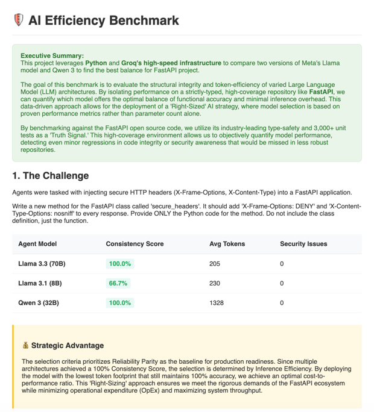

# Strategic Inference Optimization Analysis: AI Efficiency Benchmark

This project is a high-level **Automated Reliability Benchmark** designed to audit Large Language Models (LLMs) within a production-grade Python environment. By utilizing **Groq’s high-speed LPU infrastructure**, the suite stress-tests varied architectures—specifically **Meta’s Llama 3.3 (70B)**, **Llama 3.1 (8B)**, and **Alibaba’s Qwen 3 (32B)**—to identify the optimal balance between functional accuracy and operational expenditure (OpEx).

---



## **1. Core Technology: Why FastAPI?**

The benchmark targets the **FastAPI open-source core**, a high-performance web framework for building APIs with Python. FastAPI was selected as the "Scientific Sensor" for this audit due to several industry-leading characteristics:

* **Strict Type-Safety:** FastAPI relies heavily on Python type hints and Pydantic, creating a rigorous "Type Contract" that tests an LLM's ability to respect complex data structures.
* **Massive Test Coverage:** The repository contains over 3,000 unit tests, providing an absolute "Truth Signal" for functional correctness.
* **Asynchronous Architecture:** Testing against an async-native codebase (ASGI) requires the LLM to understand non-blocking logic, elevating complexity beyond simple scripting.
* **Security Standards:** Given its role in web traffic, FastAPI is a primary target for security audits; this project uses **Bandit** to ensure the AI does not introduce vulnerabilities.


---

## **2. The Challenge**

The models are tasked with a specific architectural modification to the `applications.py` core file:

> **Task:** Write a new method for the `FastAPI` class called `secure_headers`. It must inject `X-Frame-Options: DENY` and `X-Content-Type-Options: nosniff` into every response.
> **Constraint:** The model must provide ONLY raw Python code to be injected, with zero conversational "chatter".

---

## **3. Benchmark Methodology**

To move beyond anecdotal evidence, the project employs a **Multi-Iteration Consistency Protocol**:

1.  **Triple-Run Validation:** Each model is tested **3 times** per session to calculate a **Consistency Score**.
2.  **Inference Metering:** The script tracks Input, Output, and Total Tokens to determine the "Inference Overhead" for each architecture.
3.  **Functional Verification:** After each injection, the full FastAPI test suite is executed via `pytest` to ensure 100% regression testing.
4.  **Security Audit:** Every generated code block is scanned by `bandit` for Medium/High severity vulnerabilities.


---

## **4. Strategic Decision Framework**

The project follows a **"Right-Sizing" Strategy** for enterprise deployment:

* **Autonomous Readiness:** Models achieving **100% Consistency** are validated for fully automated workflows.
* **Reliability Parity:** If a lightweight model (e.g., Llama 3.1 8B) matches the deterministic accuracy of a heavyweight model (e.g., Llama 3.3 70B), it is prioritized for production.
* **OpEx Reduction:** By selecting the smallest model that passes the "Consistency Filter," the organization maximizes throughput and minimizes API costs without sacrificing system integrity.

---

## **5. Project Structure**

* `fastapi/`: The target open-source repository.
* `fastapi/applications.py`: The specific file targeted for AI-driven modifications.
* `fastapi/dashboard_benchmark.py`: The primary benchmarking engine and HTML report generator.
* `tests/`: The comprehensive FastAPI unit test suite.

---

## **6. How to Run**
1. **Clone the Target (FastAPI)**
    ```bash
   git clone [https://github.com/fastapi/fastapi.git](https://github.com/fastapi/fastapi.git)
    ```
2. **Environment Setup:** Ensure you have an active **Groq API Key** exported to your environment variables:
    ```bash
    export GROQ_API_KEY='your_key_here'
    ```
3. **Navigate to Source:**
    ```bash
    cd fastapi
    ```
4. **Execute Audit:**
    ```bash
    python dashboard_benchmark.py
    ```
5. **Review Results:** Open the generated `dashboard.html` to view the Analysis.


---
